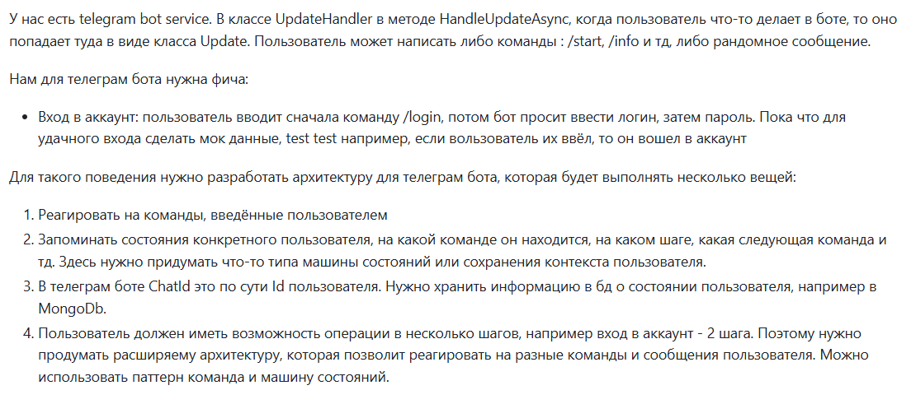
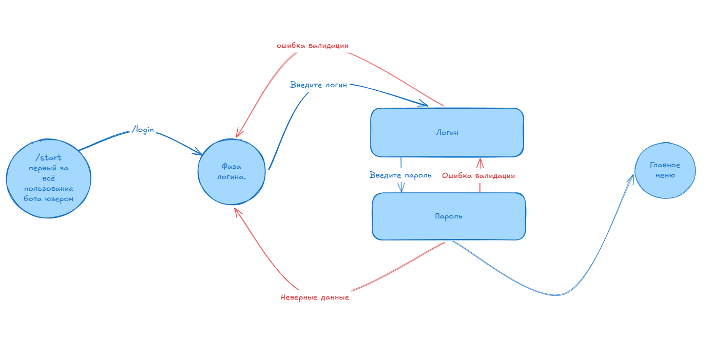
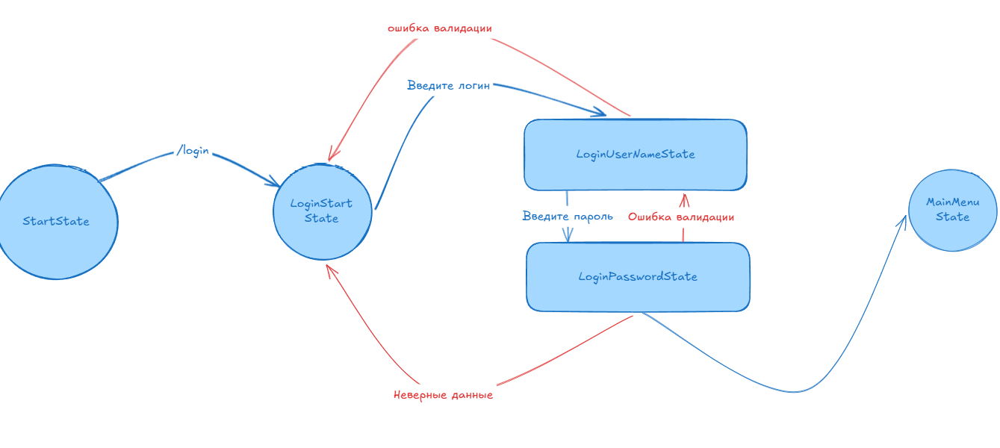
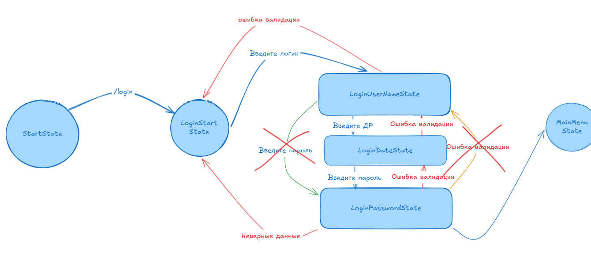

Прежде чем начать говорить о проектировании нужно продублировать задачу поставленную передо мной и разобрать пайплайн который проходит запрос от а до я в пределах текущей задачи.



Для начала разберем что такое команда и что такое сообщение в рамках Телеграмм бота. Мы получаем от бота Update , который может быть разным типом данных, но на данный момент нас интересует только Message. Сама команда также является Message и единственное отличие от обычного сообщения это то , что значения свойства Text у Message будет начинаться с '/'.

Теперь рассмотрим как выглядит схема взаимодействия пользователя с ботом как только он заходит в бота.



Отсюда видно , что нам нужно пройти через состояния (каждый кружок и квадрат представляют из себя единицу состояния, квадраты показывают те состояния, что очень связаны между собой, позже это будет обговорено).

Чтобы реализовать это состояние нужно использовать определенную стейт машину , базовую реализацию которой я написал ниже. Однако прежде чем подходить к стейт машине нужно посмотреть что из себя представляет сам Стейт.

Я использовал паттерн Состояние (однако немного его видеоизменил), чтобы реализовать машину состояния и её связь с состояниями. Каждое состояние уникально, однако оно должно реализовать интерфейс IState

```csharp
public interface IState  
{  
    Task Enter();  
    Task<IState> HandleMessage(Message message);  
    Task Exit();  
}
```

На данном этапе я рассматриваю только сообщения, но ничего не мешает использовать нам Update update вместо message и передать отвественность за обработку самому стейту. Важное замечание - ВСЯ обработка текущего стейта лежит только на ТЕКУЩЕМ стейте - все состояния уникальны и все состояния обрабатывают себя же. Они не знают о предыдущем состоянии и не знают о следущем, всё что они могут знать это то, какое состояние будет после них по определенной логике, а само переключение состояния будет у StateMachine. Для начала я немного видоизменю схему и назову каждый элемент схемы тем состоянием , которое его характеризует.



Рассмотрим StartState:

```csharp
public class StartState : IState  
{   
    private readonly long _chatId;  
    private readonly ITelegramBotClient _botClient;  
    
    public StartState(long chatId, ITelegramBotClient botClient)  
    {
        _chatId = chatId;  
        _botClient = botClient;  
    }  
    public async Task Enter()  
    {        
	    await _botClient.SendTextMessageAsync(_chatId,   
			"Привет! Введи /help для просмотра доступных команд.");  
    }  
    public async Task<IState> HandleMessage(Message message)  
    {       
	    await _botClient.SendTextMessageAsync(_chatId,   
			"Привет! Введи /help для просмотра доступных команд.");  
		
		return null;
    }  
    public Task Exit()  
    {        
	    return Task.CompletedTask;  
    }
}
```

Однако здесь возникает проблема того, что нам нужно передать chatId и ITelegramBotClient, второе мы можем получить из DI , однако первое нам нужно конкретно передать в state. Однако сейчас не будем обращать на это внимание.

Обратим внимание на методы Enter, HandleMessage, Exit. Логика следующая:

Enter() - отвечает за обработку состояния когда оно только заходит в это состояние, Exit() - наоборот, последний шаг перед тем как переключиться на новое состояние.

Метод HandleMessage - это единственный метод состояния, который может быть вызван несколько раз. В нем хранится обработка текущего состояния, валидация данных введенных пользователем и прочие процессы. Метод возвращает IState - состояние на которое мы перейдем если все прошло успешно, как мы видим в стартовом состоянии нету возможности перейти куда-либо, такое тоже бывает, чтобы нам перейти на форму логина нам нужно конкретно ввести команду /login. Чтобы оставаться на текущем состоянии мы возвращаем null, а чтобы понять как это работает - рассмотрим UserStateMachine:

```csharp
public class UserStateMachine  
{  
    private IState currentState;
    
    private void ChangeState(IState newState)  
    {        
	    currentState?.Exit();  
        currentState = newState;  
        currentState?.Enter();  
    }  
    public void HandleMessage(Message message)  
    {        
	    var newState = currentState?.HandleMessage(message); 

		if (newState is not null)
			ChangeState(newState);
    }  

	public void InitState(IState state)
	{
		currentState = state;
	}
}
``` 

Здесь мы видим когда вызывается методы Exit Enter - куда более я строго не рекомендую вызывать их внутри самого состояния, эти методы должны быть вызваны только UserStateMachine - она контролирует работу состояния текущего.

Но где же хранить все состояния? Для этого я решил использовать MongoDb и хранить простой UserState:

```csharp
public class UserState  
{  
    [BsonId]  
    public long ChatId { get; init; }  
  
    public required int State { get; init; }  
}
```

Также нужно будет создать константы - все состояния в системе чтобы можно было определять какое состояние соответствует определенному номеру в документе. 

Также реализуем MongoDbContext для работы с документами:

```csharp
public class MongoDbContext(IMongoClient mongoClient)  
{  
    private readonly IMongoDatabase _database = mongoClient.GetDatabase("telegram_bot_service");  
  
	public IMongoCollection<UserState> UserStates =>_database.GetCollection<UserState>("user_state");  
}
```

И соответствующий репозиторий:

```csharp
public class UserStateRepository  
{  
    private readonly MongoDbContext _dbContext;  
  
    public UserStateRepository(MongoDbContext dbContext)  
    {        
	    _dbContext = dbContext;  
    }  
    
    public async Task Add(UserState userState, CancellationToken cancellationToken = default)  
    {        
	    await _dbContext.UserStates.InsertOneAsync(userState, cancellationToken: cancellationToken);  
    }    
    
    public async Task Update(UserState userState, CancellationToken cancellationToken = default)  
    {        
	    var filter = Builders<UserState>.Filter.Eq(us => us.ChatId, userState.ChatId);  
  
        var update = Builders<UserState>.Update  
            .Set(us => us.State, userState.State);  
  
        await _dbContext.UserStates.UpdateOneAsync(filter, update, cancellationToken: cancellationToken);  
    }  
    
    public async Task<UserState> Get(long userId, CancellationToken cancellationToken = default)  
    {        
	    return await _dbContext.UserStates.Find(f => f.ChatId == userId)  
            .FirstOrDefaultAsync(cancellationToken: cancellationToken);  
    }
}
```

До этого мы поняли , что работать с State напрямую нельзя и  нужно использовать UserStateMachine , однако нам нужно каким-то образом передать туда текущий State. Писать везде InitState - не удобно и можно забыть, а поэтому нам нужно воспользоваться чем-то иным - например создать специальный Builder , в который мы будем передавать ChatId - для того чтобы получить из MongoDb (DbContext мы получим из Di внутри билдера) номер текущего стейта, также нам нужна отдельная Фабрика, которая будет создавать экземпляры стейтов используя паттерн Стратегия, а мы будем передавать ей просто номер стейта. Полученный экземпляр засунем в Builder и вместе со всем этим создадим нужный экземпляр UserStateMachine - готовый к использованию. Его мы уже будем использовать в обработке сообщений и прочего - это наш Manager для работы с состояниями.

Но что делать с командами? Не все же команды обладают состояниями и в отличие от сообщений - команды могут быть вызваны в любой момент. Это верно подмечено поэтому я решил, что все команды тоже имеют State.

К примеру команда - /start - перекинет нас на главное меню и мы можем потерять некоторые данные (например когда мы ввели юзернейм но не успели ввести пароль)

Придется снова отойти от команд и перейдем к этой форме (к квадратам о которых я хотел упомянуть).

Квадраты - это два стейта однако их отличие в том, что они представляют из себя форму логина. Телеграмм не позволяет удобно это реализовать поэтому я пришел к следующей идее. LoginUserNameState, LoginPasswordState:

```csharp
public class LoginUserNameState : IState  
{  
    private readonly long _chatId;  
    private readonly ITelegramBotClient _botClient;  
  
    public LoginUserNameState(long chatId, ITelegramBotClient botClient)  
    {  
        _chatId = chatId;  
        _botClient = botClient;  
    }  
    
    public async Task Enter()  
    {       
	    await _botClient.SendTextMessageAsync(_chatId,   
			"Введите своё имя пользователя.");  
    }  
    public async Task<IState> HandleMessage(Message message)  
    {        
	    if (message.Text!.Length > 100)  
        {            
	        await _botClient.SendTextMessageAsync(_chatId,   
				"Слишком большой логин, указывай реальные данные.");  
            return null;  
        }       

		// Записываем юзернейм в редис 

		// Создаем Job
    
        return new LoginPasswordState(_chatId, _botClient);    
    } 
     
    public Task Exit()  
    {        
	    return Task.CompletedTask;  
    }
}
```

```csharp
public class LoginPasswordState : IState  
{   
    private readonly long _chatId;  
    private readonly ITelegramBotClient _botClient;  
  
    public LoginPasswordState(long chatId, ITelegramBotClient botClient)  
    {       
        _chatId = chatId;  
        _botClient = botClient;  
    }  
    public async Task Enter()  
    { 
        await _botClient.SendTextMessageAsync(_chatId,   
			"Введи свой пароль.");  
    }  
    public async Task<IState> HandleMessage(Message message)  
    {        
	    if (message.Text!.Length > 100)  
        {            
	        await _botClient.SendTextMessageAsync(_chatId,   
				"Указывай реальные данные.");  
            return null;  
        }        

		//Получаем юзернейм из редиса.

		//Отсылаем на сервер аутентификации и валидируем

		//Удаляем Job

        return new MainMenuState(_chatId, _botClient); 
    }  
    public async Task Exit()  
    {        
	    await _botClient.SendTextMessageAsync(_chatId,   
			"Ты успешно авторизован. Спасибо.");  
    }
}
```

Здесь мы будем в рамках одной формы хранить временные данные. Будут они иметь следующий вид (можно переделать но суть уловить надо)

(ChatId = 456)

| Id  | Form Name | Attributes           |     |
| --- | --------- | -------------------- | --- |
| 456 | LoginForm | {"UserName" : "Bob"} |     |
| ... | ...       | ...                  |     |
Для каждой такой формы (а их может быть множество) будет свое имя формы и аттрибуты этой формы (произвольные нужные только для нее)

Ко всему этому время жизни эти объектов будет составлять всего 30 минут (к примеру). И мы будем запускать отдельную Job для проверки того висят ли эти данные и смог ли пользователь до конца заполнить форму. Если не успел будем через BackGround сервис менять его состояние в MongoDb на какое-то произвольное (Либо старт либо главное меню - зависит от ситуации, этим заниматься будет фоновый сервис а не машина состояний) Если пользователь залогиниться то просто перейдет на следующий стейт и мы принудительно удалим Job и данные из Redis , а если нет то остальное сделает бекграунд сервис

Теперь мы решили проблему с выходом пользователя во время ухода из логина, а что делать если он уйдет через тот же /start а не время истечет? Тогда сама команда start (она имеет состояние) закинет его на свое состояние (Стартовое если не залогинен и главное меню если залогинен) и просто удалит все данные что он успел ввести чтобы избежать конфликты (Просто удалит из Redis все объекты для текущего ChatId)

А что насчет help? Произойдет аналогичное действие, мы перейдем на HelpState и сбросим все данные. Да может это немного не UserFriendly , но это поможет избежать многих конфликтов. Само состояние Help будет циклично, чтобы выйти из него нужно будет использовать другую команду, которые она будет выводить.

Бонусом я реализовал функционал, который через рефлексию собирает все комманды которые есть в системе что позволяет удобно добавлять новые - просто нужно реализовать интерфейсы IState + ICommand

```csharp
public interface ICommand  
{  
    string Description { get; }  
}
```

Из-за того что команд мало я решил хранить описание сразу в самой команде.

Пример :

```csharp
public class HelpCommandState : ICommand , IState 
{  
	public string Name { get; }  = "Позволяет узнать подробности о командах.";

    ...
    
    public async Task<IState> HandleMessage(Message message)  
    {        
	    var stringBuild = new StringBuilder();  
	    
        stringBuild.Append("Доступные команды:\n");  
        
        var type = typeof(ICommand);  
        
        var types = AppDomain.CurrentDomain.GetAssemblies()  
            .SelectMany(s => s.GetTypes())  
            .Where(p => type.IsAssignableFrom(p) && p != type);  
  
        foreach (var inputType in types)  
        {   
                 
        stringBuild.Append('/' + inputType.Name.Replace("CommandState", "").ToLower()); 
        stringBuild.Append(inputType.GetProperty(nameof(Name))?.GetValue(null)?.ToString() + "\n"); 
        
        } 
               
        await _botClient.SendTextMessageAsync(message.Chat, stringBuild.ToString());  

		return null;
    }  

	...
}
```


А также я использовал паттерн Команда для того чтобы узнать какой именно стейт нужно вызывать. Использовал его я в хендлере комманд, который вызывается из HandleUpdate

```csharp
//Класс - Update Handler

...


public async Task HandleUpdateAsync(  
    ITelegramBotClient botClient,   
Update update,   
CancellationToken cancellationToken)  
{  
    cancellationToken.ThrowIfCancellationRequested();  
    await (update switch  
    {  
        { Message: { } message } => ProcessMessage(message, cancellationToken),  
        _ => UnknownUpdateHandler(update, cancellationToken)  
    });}  
  
private async Task ProcessMessage(Message message, CancellationToken cancellationToken)  
{  
    _logger.LogInformation("Receive message type: {MessageType}", message.Type);  
    if (string.IsNullOrEmpty(message.Text))  
        return;  
  
    await CheckForUserState(message, cancellationToken);  
    var scope = _serviceScopeFactory.CreateScope();  
    if (message.Text.StartsWith('/'))  
    {        var handler = scope.ServiceProvider.GetService<OnCommandHandler>();  
        await handler!.HandleAsync(message);  
    }    else  
    {  
        var handler = scope.ServiceProvider.GetService<OnMessageHandler>();  
        await handler!.HandleAsync(message);  
    }}


...
```

OnCommandHandler : 

```csharp
public class OnCommandHandler  
{  
    private readonly ITelegramBotClient _botClient;  
    private readonly IServiceProvider _serviceProvider;  
    private readonly Dictionary<string, ICommand> _commands = new();  
  
    public OnCommandHandler(ITelegramBotClient botClient, IServiceProvider serviceProvider)  
    {        
	    _botClient = botClient;  
        _serviceProvider = serviceProvider;  
        InitCommands();  
    }  
    public async Task HandleAsync(Telegram.Bot.Types.Message message)  
    {        
	    if (_commands.TryGetValue(message.Text, out var command))  
        {           
	        await command.HandleMessage(message);  
        }        
        else  
        {  
            await _botClient.SendTextMessageAsync(message.Chat,  
                "Неизвестная команда. Используйте /help для получения списка команд.");  
        }    
    }  
    
    private void InitCommands()  
    {        
	    var type1 = typeof(ICommand);  
        var type2 = typeof(IState);  
        
        var types = AppDomain.CurrentDomain.GetAssemblies()  
            .SelectMany(s => s.GetTypes())  
            .Where(p => (type1.IsAssignableFrom(p) && type2.IsAssignableFrom(p)) && !p.IsAbstract && p != type);  
  
        foreach (var inputType in types)  
        {            
	        var commandName = '/' + inputType.Name.Replace("CommandState", "").ToLower();  

			
            var commandInstance = (ICommand)_serviceProvider.GetService(inputType)!;  
            
            _commands.Add(commandName, commandInstance);  
        }    
    }
}
```

Однако здесь я инстансы команд создаю через Di , это просто заглушка - нужно подумать как это лучше сделать, но я бы не хотел регистрировать состояния в Di. 

Выводы:

Плюсы:
* Чтобы добавить новую команду достаточно реализовать два интерфейса и все остальное подкрутит система
* Состояния не зависят сильно друг от друга что позволяет выстраивать большие цепочки. Мы можем создать новое состояние которое будет между двумя существующими поменяв логику состояния, что вызывает следующее но должно будет вызывать текущее, а текущее уже должно будет вызывать следующее - Пример на картинке (Нужно указывать после логина еще и день рождения) 
* Достигается неплохая гибкость системы

Минусы:
* Все команды имеют состояние - иногда может раздражать
* Из-за того, что состояния независимы - мы не можем возвращаться назад (в теории можем добавить для каждого состояния новый контракт с возвращением назад и просто пользователь сможет вводить слово "Отмена" и тем самым вызывать новый метод RollBack который просто вернет состояние (мы вызовем его внутри HandleMessage и вернем IState) в которое нужно перейти как прошлое или вводить команду /cancel , которая будет искать текущее состояние и вызывать новый RollBack только в отдельном сервисе который будет работать напрямую с MongoDb и UserState, а не UserStateMachine, но это создаст дополнительный конфликты с Redis и TemporaryData , которые нужно будет решать)


Мои пожелания к работе с тг сервисом: Учитывая что мы начали реализовывать все с нуля то можно было бы еще инкапсулировать работу с клиентом ТГБота в отдельном сервисе а сами сообщения будут уже там а передавать мы будем только код - это позволит в будущем добавить многоязычность - мы сможем отсылать сообщения на нужном языке и не придется менять систему, а только файлы локализации.